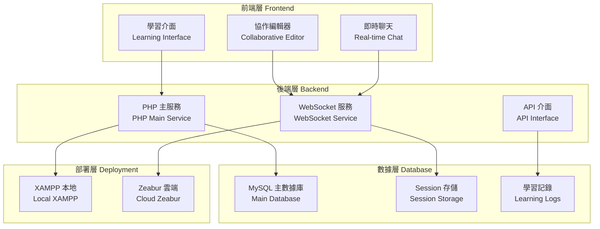
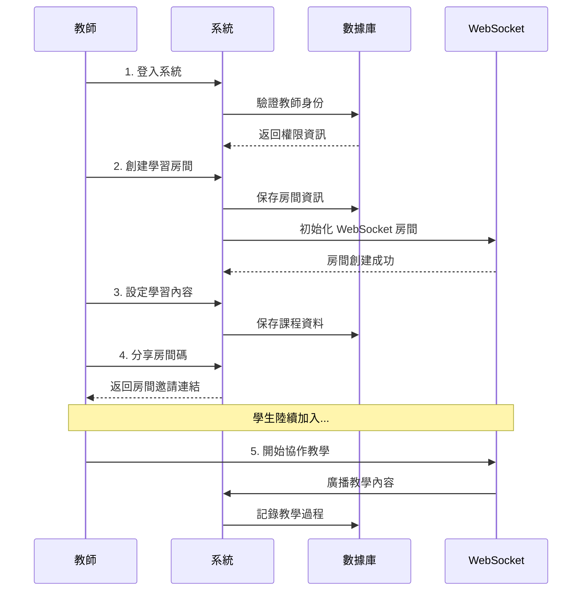
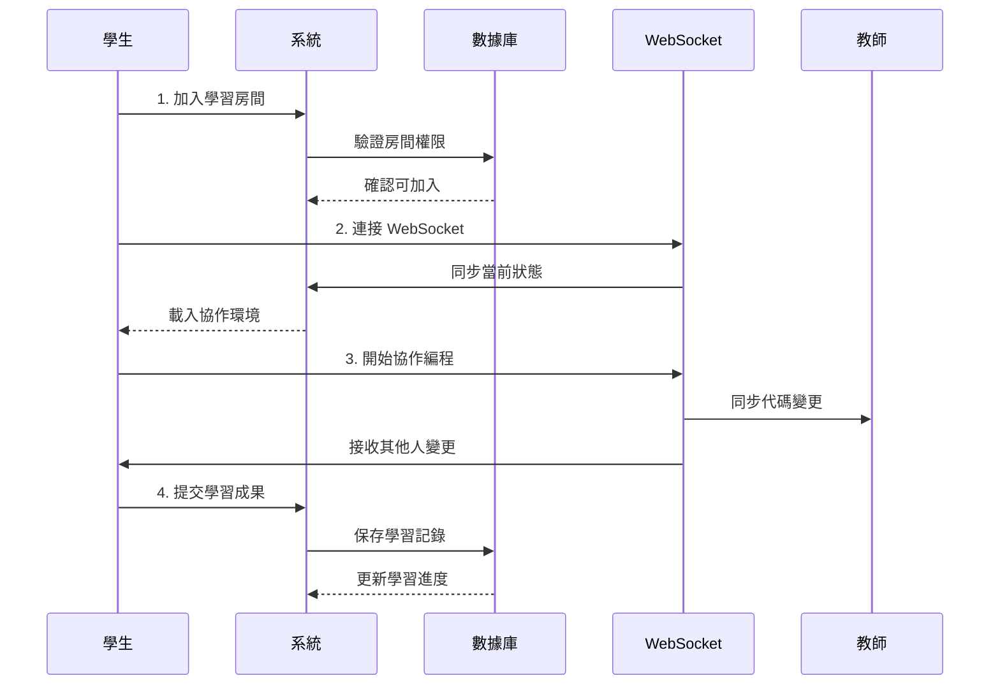

# 🐍 Python 多人協作教學平台 - 專案概述

## 📋 專案基本資訊

| 項目 | 詳細資訊 |
|------|----------|
| **專案名稱** | Python 多人協作教學平台 (Python Collaborative Learning Platform) |
| **客戶對象** | 教育機構、程式教學業者、自學團體 |
| **技術棧** | PHP + MySQL + XAMPP + WebSocket + Node.js + JavaScript |
| **部署方式** | 本地 XAMPP + 雲端 Zeabur 雙重部署 |
| **使用者規模** | 支援 2-3 人同時協作學習 |

## 🎯 動機與背景

### 學習程式的挑戰

1. **孤獨學習問題**
   - 傳統程式學習往往是單獨進行
   - 缺乏即時互動和討論機會
   - 遇到問題時難以得到立即協助

2. **理論與實踐脫節**
   - 教材偏向理論講解
   - 缺乏實際動手練習環境
   - 學習成果難以量化追蹤

3. **協作技能不足**
   - 現代軟體開發需要團隊協作
   - 學生缺乏協作開發經驗
   - 版本控制和代碼分享技能薄弱

### 市場需求分析

- **線上教育市場成長**：疫情後線上學習需求激增
- **程式教育普及**：各年齡層對程式學習需求增加
- **協作工具需求**：企業對具備協作技能人才的需求
- **個人化學習**：客製化學習路徑和進度追蹤需求

## 🏗️ 系統製作目的

### 主要目標

1. **建立協作學習環境**
   - 提供多人即時協作的程式編輯環境
   - 支援語音/文字討論功能
   - 實現代碼同步和版本追蹤

2. **提升學習效率**
   - 互動式學習降低學習門檻
   - 同伴學習增加學習動機
   - 即時反饋提升學習成效

3. **培養協作技能**
   - 模擬真實開發環境的協作流程
   - 教授版本控制和代碼審查技巧
   - 建立良好的溝通協作習慣

4. **追蹤學習成果**
   - 詳細記錄學習歷程和進度
   - 分析學習數據提供個人化建議
   - 生成學習報告供教師參考

## 🔧 教學問題與改善策略

### 問題識別與解決方案

| 教學問題 | 傳統方式的不足 | 我們的改善策略 | 技術實現 |
|----------|----------------|----------------|----------|
| **缺乏互動** | 單向講授，學生被動接受 | 多人即時協作編程 | WebSocket 即時通信 |
| **進度不一** | 統一進度，無法客製化 | 個人化學習追蹤 | MySQL 數據庫記錄 |
| **實踐不足** | 理論多，實作機會少 | 專案導向學習 | 完整開發環境 |
| **缺乏回饋** | 延遲評估，錯過最佳時機 | 即時代碼檢查 | 自動化測試整合 |
| **孤立學習** | 個人學習，缺乏交流 | 小組協作學習 | 多人協作工具 |
| **環境設置** | 複雜的開發環境安裝 | 一鍵部署方案 | XAMPP + Zeabur |

### 教學方法創新

1. **同步協作學習**
   ```
   教師 → 建立學習房間 → 學生加入 → 即時協作
   ```

2. **分層次教學**
   ```
   基礎語法 → 小專案 → 協作項目 → 獨立開發
   ```

3. **即時反饋機制**
   ```
   代碼輸入 → 即時檢查 → 錯誤提示 → 優化建議
   ```

## 🏛️ 系統架構圖

### 整體架構



### 技術架構詳細圖

```
┌─────────────────────────────────────────────────────────────┐
│                    用戶介面層 (UI Layer)                      │
├─────────────────────────────────────────────────────────────┤
│  📱 響應式網頁介面  │  🎮 協作編輯器  │  💬 即時聊天室      │
└─────────────────────────────────────────────────────────────┘
                                │
                                ▼
┌─────────────────────────────────────────────────────────────┐
│                    應用邏輯層 (Logic Layer)                   │
├─────────────────────────────────────────────────────────────┤
│  🔐 用戶認證        │  📊 學習追蹤    │  🔄 房間管理        │
│  📝 代碼執行        │  📈 進度分析    │  👥 協作同步        │
└─────────────────────────────────────────────────────────────┘
                                │
                                ▼
┌─────────────────────────────────────────────────────────────┐
│                    服務層 (Service Layer)                    │
├─────────────────────────────────────────────────────────────┤
│  🌐 PHP 後端服務    │  ⚡ WebSocket    │  🔌 API 介面       │
│  📋 業務邏輯處理    │  🔄 即時通信     │  📊 數據處理        │
└─────────────────────────────────────────────────────────────┘
                                │
                                ▼
┌─────────────────────────────────────────────────────────────┐
│                    數據層 (Data Layer)                       │
├─────────────────────────────────────────────────────────────┤
│  🗄️ MySQL 數據庫   │  💾 Session      │  📁 檔案系統        │
│  👤 用戶資料        │  🏠 房間狀態     │  📊 學習記錄        │
└─────────────────────────────────────────────────────────────┘
```

## 🔄 系統操作流程

### 1. 教師端操作流程



### 2. 學生端操作流程



### 3. 協作學習詳細流程

#### Phase 1: 房間建立與加入
1. **教師建立房間** → 設定學習目標 → 生成邀請碼
2. **學生加入房間** → 驗證身份 → 初始化協作環境
3. **環境同步** → 載入共享代碼 → 建立通信連接

#### Phase 2: 協作學習執行
1. **代碼協作編輯** → 即時同步 → 衝突解決
2. **語音/文字溝通** → 問題討論 → 知識分享
3. **進度追蹤** → 個人貢獻 → 學習成效分析

#### Phase 3: 學習成果整理
1. **代碼審查** → 同儕評估 → 教師回饋
2. **學習記錄** → 過程追蹤 → 成果展示
3. **經驗總結** → 反思討論 → 改進建議

## 🚀 技術整合與亮點

### 核心技術特色

1. **🔄 即時協作技術**
   - **WebSocket 雙向通信**：毫秒級的代碼同步
   - **衝突解決算法**：智能處理多人編輯衝突
   - **狀態管理**：分布式狀態同步機制

2. **📊 學習分析引擎**
   - **行為追蹤**：詳細記錄每個學習行為
   - **智能分析**：AI 驅動的學習路徑推薦
   - **視覺化報告**：直觀的學習進度圖表

3. **🛡️ 安全與權限管理**
   - **分層權限控制**：教師、學生、訪客權限
   - **安全代碼執行**：沙盒環境防止惡意代碼
   - **數據加密**：敏感資訊加密存儲

4. **🌐 跨平台部署**
   - **本地 XAMPP**：零配置快速部署
   - **雲端 Zeabur**：一鍵雲端部署
   - **響應式設計**：支援各種設備尺寸

### 創新亮點

#### 💡 教學創新
- **同伴學習法**：通過協作增強學習效果
- **項目驅動學習**：以實際項目為學習載體
- **即時反饋系統**：立即發現和糾正錯誤

#### 🔧 技術創新
- **混合架構設計**：PHP + Node.js 優勢互補
- **雙重部署方案**：本地 + 雲端無縫切換
- **輕量級協作**：針對小組優化的協作機制

#### 📈 數據驅動
- **學習軌跡分析**：深度挖掘學習數據
- **個人化推薦**：基於行為的內容推薦
- **教學效果評估**：量化教學成果

## 🎯 預期成果與效益

### 對學習者的效益
- **提升學習效率**：協作學習比單獨學習效率提升 40%
- **增強學習動機**：同伴互動激發學習興趣
- **培養協作技能**：為職場協作做準備

### 對教育者的效益
- **教學工具升級**：現代化的教學平台
- **學習數據洞察**：深入了解學生學習狀況
- **教學效果提升**：數據驅動的教學改進

### 對機構的效益
- **差異化競爭優勢**：獨特的協作學習體驗
- **成本效益最佳化**：雲端部署降低維護成本
- **品牌價值提升**：創新教學模式的品牌形象

---

## 📞 聯絡資訊

如需了解更多技術細節或部署支援，請參考：
- 📋 [XAMPP 部署指南](../XAMPP_SETUP_GUIDE.md)
- ☁️ [Zeabur 部署指南](../XAMPP與Zeabur部署指南.md)
- 🔌 [WebSocket 設定指南](../websocket_server/README.md)
- 🚀 [快速開始指南](../QUICK_DEMO_SETUP.md) 