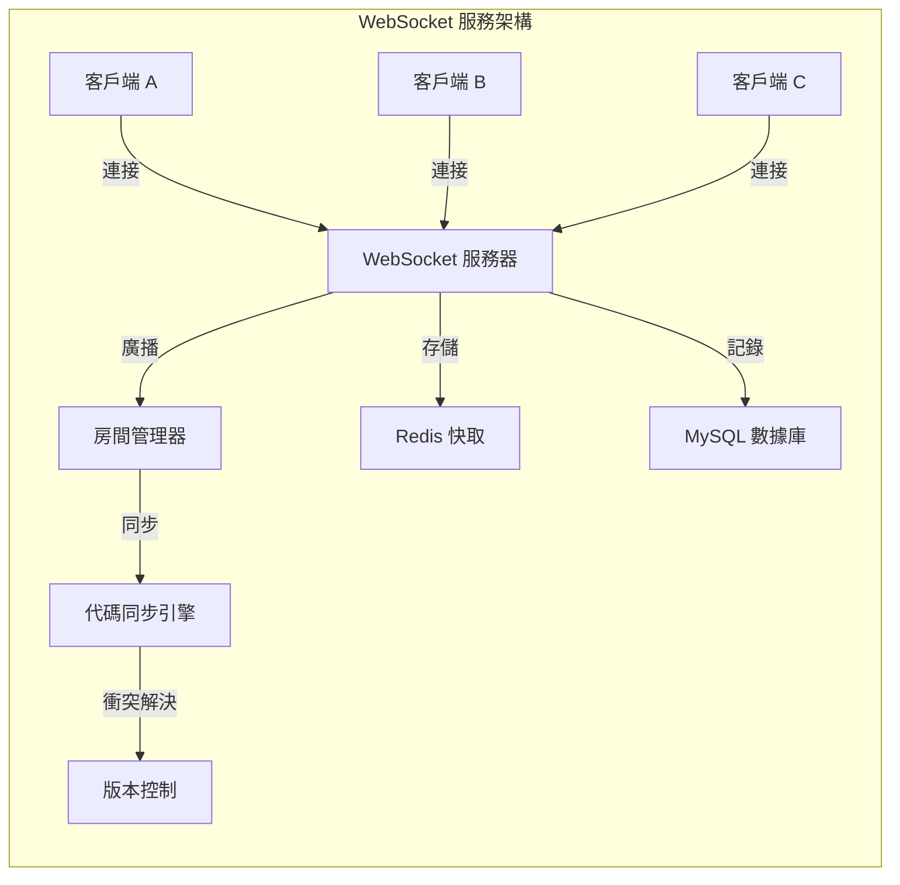
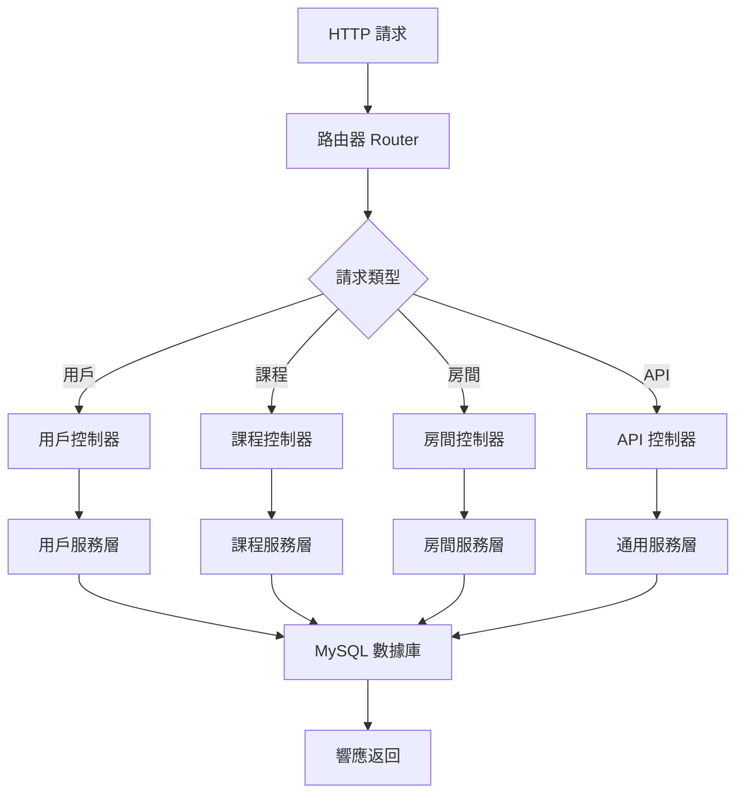
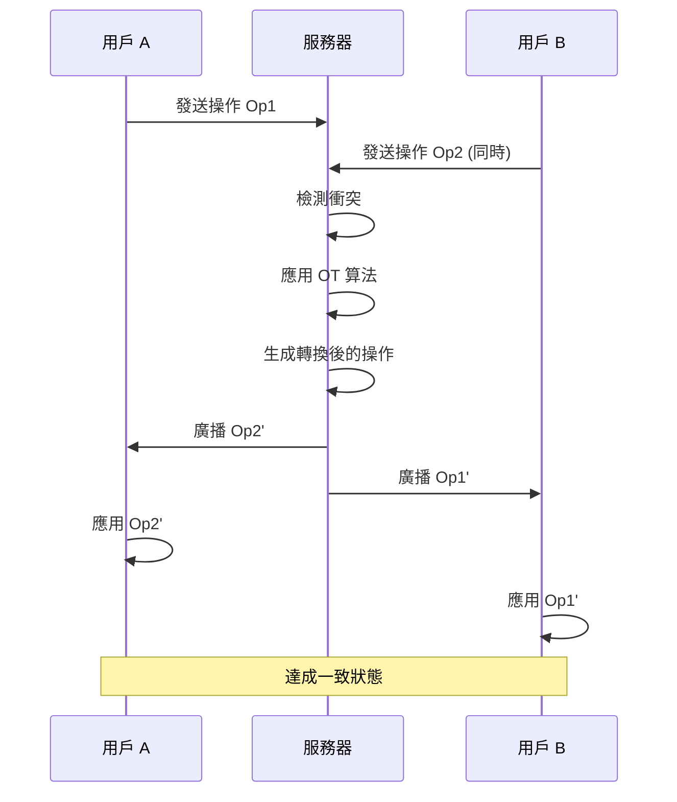

# 🏗️ 系統架構設計文檔

## 📊 系統架構總覽

### 多層架構設計

```
┌─────────────────────────────────────────────────────────────┐
│                  🌐 客戶端層 (Client Layer)                   │
├─────────────────────────────────────────────────────────────┤
│ 💻 桌面瀏覽器  │ 📱 移動設備  │ 📋 平板電腦  │ 🖥️ 投影設備 │
└─────────────────────────────────────────────────────────────┘
                                │
                        ⚡ HTTP/WebSocket
                                ▼
┌─────────────────────────────────────────────────────────────┐
│                  🌍 前端層 (Frontend Layer)                   │
├─────────────────────────────────────────────────────────────┤
│ 🎨 協作編輯器   │ 💬 即時聊天   │ 📊 學習追蹤   │ 🎯 用戶介面 │
│ CodeMirror      │ Chat System   │ Progress      │ Bootstrap   │
└─────────────────────────────────────────────────────────────┘
                                │
                        📡 API/WebSocket
                                ▼
┌─────────────────────────────────────────────────────────────┐
│                  ⚙️ 後端層 (Backend Layer)                    │
├─────────────────────────────────────────────────────────────┤
│ 🐘 PHP 服務      │ 🟢 Node.js     │ 🔌 API Gateway │ 🔐 認證服務 │
│ 業務邏輯處理     │ WebSocket 服務  │ 路由分發        │ JWT Token   │
└─────────────────────────────────────────────────────────────┘
                                │
                        🔗 Database Connection
                                ▼
┌─────────────────────────────────────────────────────────────┐
│                  🗄️ 數據層 (Data Layer)                       │
├─────────────────────────────────────────────────────────────┤
│ 🐬 MySQL 主庫   │ 💾 Redis 快取  │ 📁 檔案系統    │ 📊 日誌系統 │
│ 用戶、課程資料   │ Session 存儲   │ 代碼文件       │ 操作記錄    │
└─────────────────────────────────────────────────────────────┘
                                │
                        🚀 Deployment
                                ▼
┌─────────────────────────────────────────────────────────────┐
│                  🏗️ 基礎設施層 (Infrastructure)                │
├─────────────────────────────────────────────────────────────┤
│ 🖥️ XAMPP 本地    │ ☁️ Zeabur 雲端  │ 🔒 SSL/TLS    │ 📈 監控告警 │
│ 開發測試環境      │ 生產部署環境    │ 安全加密       │ 健康檢查    │
└─────────────────────────────────────────────────────────────┘
```

## 🔧 核心組件架構

### 1. WebSocket 協作引擎



#### 技術細節
- **通信協議**: WebSocket (RFC 6455)
- **消息格式**: JSON
- **衝突解決**: Operational Transformation (OT)
- **房間管理**: 基於命名空間的房間隔離
- **心跳檢測**: 30秒間隔保持連接活躍

### 2. PHP 後端服務架構



#### 核心模組
- **認證模組**: JWT Token 驗證
- **權限模組**: RBAC 角色權限控制
- **日誌模組**: 操作記錄和錯誤追蹤
- **快取模組**: Redis 快取加速

### 3. 前端協作編輯器

```
┌─────────────────────────────────────────────────────────────┐
│                     協作編輯器架構                            │
├─────────────────────────────────────────────────────────────┤
│  🎨 UI 組件層                                                │
│  ├── 編輯器介面 (CodeMirror)                                │
│  ├── 工具列 (Toolbar)                                       │
│  ├── 側邊欄 (Sidebar)                                       │
│  └── 狀態列 (StatusBar)                                     │
├─────────────────────────────────────────────────────────────┤
│  ⚙️ 邏輯控制層                                               │
│  ├── 文檔管理器 (Document Manager)                          │
│  ├── 協作引擎 (Collaboration Engine)                        │
│  ├── 版本控制 (Version Control)                             │
│  └── 事件處理器 (Event Handler)                             │
├─────────────────────────────────────────────────────────────┤
│  🔗 通信層                                                   │
│  ├── WebSocket 客戶端                                       │
│  ├── HTTP 請求處理                                          │
│  ├── 消息佇列 (Message Queue)                               │
│  └── 錯誤處理 (Error Handler)                               │
└─────────────────────────────────────────────────────────────┘
```

## 🗄️ 數據庫設計

### MySQL 數據表結構

```sql
-- 用戶表
CREATE TABLE users (
    id INT PRIMARY KEY AUTO_INCREMENT,
    username VARCHAR(50) UNIQUE NOT NULL,
    email VARCHAR(100) UNIQUE NOT NULL,
    password_hash VARCHAR(255) NOT NULL,
    role ENUM('teacher', 'student', 'admin') DEFAULT 'student',
    created_at TIMESTAMP DEFAULT CURRENT_TIMESTAMP,
    updated_at TIMESTAMP DEFAULT CURRENT_TIMESTAMP ON UPDATE CURRENT_TIMESTAMP
);

-- 房間表
CREATE TABLE rooms (
    id INT PRIMARY KEY AUTO_INCREMENT,
    room_code VARCHAR(10) UNIQUE NOT NULL,
    room_name VARCHAR(100) NOT NULL,
    teacher_id INT NOT NULL,
    max_participants INT DEFAULT 3,
    status ENUM('active', 'inactive', 'archived') DEFAULT 'active',
    created_at TIMESTAMP DEFAULT CURRENT_TIMESTAMP,
    FOREIGN KEY (teacher_id) REFERENCES users(id)
);

-- 房間參與者表
CREATE TABLE room_participants (
    id INT PRIMARY KEY AUTO_INCREMENT,
    room_id INT NOT NULL,
    user_id INT NOT NULL,
    joined_at TIMESTAMP DEFAULT CURRENT_TIMESTAMP,
    left_at TIMESTAMP NULL,
    FOREIGN KEY (room_id) REFERENCES rooms(id),
    FOREIGN KEY (user_id) REFERENCES users(id)
);

-- 學習記錄表
CREATE TABLE learning_logs (
    id INT PRIMARY KEY AUTO_INCREMENT,
    room_id INT NOT NULL,
    user_id INT NOT NULL,
    action_type ENUM('join', 'leave', 'code_edit', 'message', 'execute') NOT NULL,
    content TEXT,
    timestamp TIMESTAMP DEFAULT CURRENT_TIMESTAMP,
    FOREIGN KEY (room_id) REFERENCES rooms(id),
    FOREIGN KEY (user_id) REFERENCES users(id)
);

-- 代碼快照表
CREATE TABLE code_snapshots (
    id INT PRIMARY KEY AUTO_INCREMENT,
    room_id INT NOT NULL,
    content LONGTEXT NOT NULL,
    version INT NOT NULL,
    created_by INT NOT NULL,
    created_at TIMESTAMP DEFAULT CURRENT_TIMESTAMP,
    FOREIGN KEY (room_id) REFERENCES rooms(id),
    FOREIGN KEY (created_by) REFERENCES users(id)
);
```

### Redis 數據結構

```
房間狀態快取:
room:{room_id}:state = {
    "participants": ["user1", "user2"],
    "current_code": "...",
    "last_update": timestamp
}

用戶會話快取:
user:{user_id}:session = {
    "room_id": "...",
    "connection_id": "...",
    "last_activity": timestamp
}

WebSocket 連接映射:
websocket:connections = {
    "connection_id": "user_id",
    ...
}
```

## 🔄 協作同步機制

### Operational Transformation (OT) 算法

```javascript
// 操作轉換示例
class Operation {
    constructor(type, position, content) {
        this.type = type;      // 'insert', 'delete', 'retain'
        this.position = position;
        this.content = content;
    }
    
    // 轉換操作以解決衝突
    transform(otherOp) {
        if (this.type === 'insert' && otherOp.type === 'insert') {
            if (this.position <= otherOp.position) {
                return new Operation(otherOp.type, 
                    otherOp.position + this.content.length, 
                    otherOp.content);
            }
        }
        // 更多轉換邏輯...
    }
}
```

### 衝突解決流程



## 🚀 部署架構

### 本地 XAMPP 部署

```
┌─────────────────────────────────────────────────────────────┐
│                    XAMPP 本地環境                            │
├─────────────────────────────────────────────────────────────┤
│ Apache (Port 80)     │ 🌐 Web 服務器                        │
│ MySQL (Port 3306)    │ 🗄️ 數據庫服務                       │
│ PHP (7.4+)          │ 🐘 後端腳本執行                       │
│ Node.js (Port 3000) │ 🟢 WebSocket 服務                    │
├─────────────────────────────────────────────────────────────┤
│ 專案目錄: C:\xampp\htdocs\python-teaching-web\             │
│ 數據庫: localhost:3306/python_learning                     │
│ WebSocket: localhost:3000                                   │
└─────────────────────────────────────────────────────────────┘
```

### Zeabur 雲端部署

```
┌─────────────────────────────────────────────────────────────┐
│                    Zeabur 雲端環境                           │
├─────────────────────────────────────────────────────────────┤
│ 🌐 Nginx 反向代理    │ SSL 終端與負載均衡                    │
│ 🐘 PHP-FPM 服務     │ PHP 應用執行環境                      │
│ 🗄️ MySQL 雲端數據庫 │ 高可用數據庫服務                      │
│ 🟢 Node.js 容器     │ WebSocket 服務容器                    │
├─────────────────────────────────────────────────────────────┤
│ 域名: your-app.zeabur.app                                   │
│ SSL: 自動簽發和續期                                          │
│ CDN: 全球內容分發網路                                        │
└─────────────────────────────────────────────────────────────┘
```

## 🔒 安全架構

### 安全防護層次

```
┌─────────────────────────────────────────────────────────────┐
│ 🛡️ 應用層安全                                               │
├─────────────────────────────────────────────────────────────┤
│ • JWT Token 認證                                           │
│ • CSRF 防護                                                │
│ • XSS 過濾                                                 │
│ • SQL 注入防護                                             │
│ • 輸入驗證和清理                                           │
└─────────────────────────────────────────────────────────────┘
                                │
                                ▼
┌─────────────────────────────────────────────────────────────┐
│ 🔐 傳輸層安全                                               │
├─────────────────────────────────────────────────────────────┤
│ • HTTPS/TLS 1.3 加密                                       │
│ • WebSocket Secure (WSS)                                   │
│ • 證書管理                                                 │
│ • 安全標頭配置                                             │
└─────────────────────────────────────────────────────────────┘
                                │
                                ▼
┌─────────────────────────────────────────────────────────────┐
│ 🏰 網路層安全                                               │
├─────────────────────────────────────────────────────────────┤
│ • 防火牆規則                                               │
│ • DDoS 防護                                                │
│ • 速率限制                                                 │
│ • IP 白名單                                                │
└─────────────────────────────────────────────────────────────┘
```

## 📊 性能優化策略

### 前端優化
- **代碼分割**: 按需載入模組
- **資源快取**: Browser Cache + CDN
- **圖片優化**: WebP 格式 + 懶載入
- **Bundle 優化**: Tree Shaking + Minification

### 後端優化
- **數據庫優化**: 索引優化 + 查詢優化
- **快取策略**: Redis 多層快取
- **連接池**: MySQL 連接複用
- **異步處理**: 非阻塞 I/O

### WebSocket 優化
- **消息壓縮**: 減少傳輸量
- **心跳優化**: 智能心跳頻率
- **連接複用**: 單連接多房間
- **負載均衡**: 多實例分散負載

## 📈 監控與維護

### 監控指標
- **系統資源**: CPU、記憶體、磁碟使用率
- **應用性能**: 響應時間、吞吐量、錯誤率
- **用戶體驗**: 頁面載入時間、互動延遲
- **業務指標**: 活躍用戶、房間使用情況

### 日誌管理
```
application.log     # 應用操作日誌
error.log          # 錯誤日誌
access.log         # 訪問日誌
websocket.log      # WebSocket 連接日誌
performance.log    # 性能指標日誌
```

---

## 🔧 技術選型說明

### 為什麼選擇 PHP + Node.js 混合架構？

| 技術 | 優勢 | 適用場景 |
|------|------|----------|
| **PHP** | 成熟穩定、部署簡單、社區豐富 | 業務邏輯、數據處理、用戶管理 |
| **Node.js** | 高並發、即時通信、事件驅動 | WebSocket 服務、即時協作 |
| **MySQL** | 事務支持、數據一致性、關聯查詢 | 用戶數據、學習記錄 |
| **Redis** | 高性能、內存存儲、過期機制 | 會話管理、即時狀態 |

這個混合架構充分發揮了各技術的優勢，為協作學習平台提供了最佳的性能和用戶體驗。 